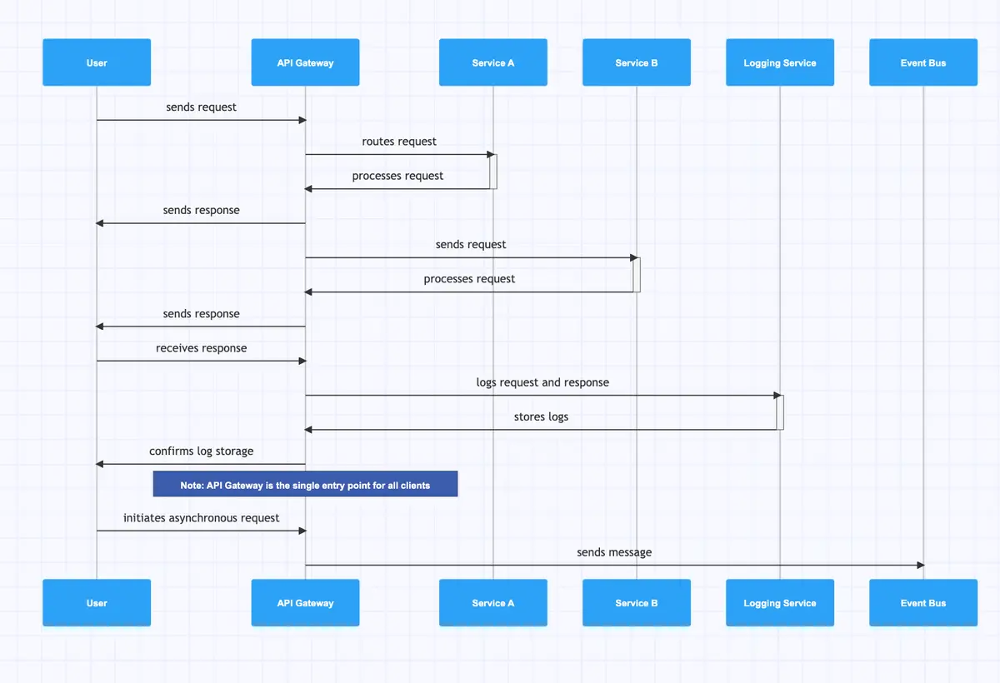

# Crear diagrama de secuencia

Después de terminar el caso de uso:

1. Identificar actores
2. Identificar servicios
3. Dibujar comunicación entre servicios

---

# Qué debe mostrar el diagrama

- quién inicia
- qué servicio responde
- llamadas REST
- eventos async
- callbacks

---

# ejemplo

# PASO 15 — Crear diagrama de secuencia

Después de terminar el caso de uso:

1. Identificar actores
2. Identificar servicios
3. Dibujar comunicación entre servicios

---

# Herramienta recomendada

gleek

DIAGRAMA DE SECUENCIA

videotutorial de uso: https://youtu.be/OFatM_EyqbE

---

# Qué debe mostrar el diagrama

- quién inicia
- qué servicio responde
- llamadas REST
- eventos async
- callbacks

---
---

# ejemplo

